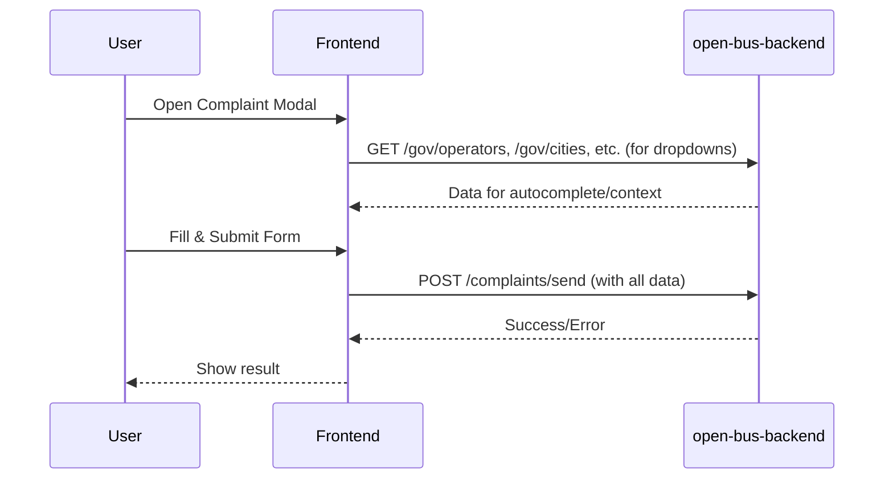
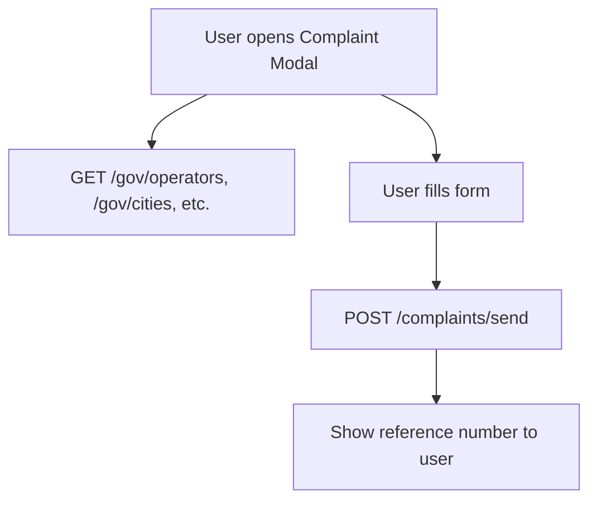

# Complaint Form Integration Plan (Corrected, 2025-09-08)

## Overview
This document details how the complaint modal integrates with the real open-bus-backend API. All endpoints listed here are confirmed to exist in the backend OpenAPI spec as of 2025-09-08. Irrelevant or non-existent endpoints have been removed.

---

## 1. Data Sources and Flow

### Primary: open-bus-backend
- Main API for complaint modal: complaint submission and government data enrichment.
- Docs: https://open-bus-backend.k8s.hasadna.org.il/docs#/

### Secondary: open-bus-stride-api (optional)
- Provides SIRI (realtime) and GTFS (planned) data for further enrichment/validation (not directly supported by open-bus-backend as of 2025-09-08).

---

## 2. Integration Flow



---


## Appendix: open-bus-backend API Endpoint Usage Summary (Real Endpoints Only)

This section lists only the endpoints that actually exist in the [open-bus-backend](https://open-bus-backend.k8s.hasadna.org.il/docs) API and are relevant to the complaint modal as of 2025-09-08.

| Method | Path                | Purpose                                 | Used in Complaint Modal? | Notes |
|--------|---------------------|-----------------------------------------|-------------------------|-------|
| POST   | /complaints/send    | Submit a new complaint                  | **YES**                 | Main endpoint for submitting user complaints. |
| GET    | /gov/cities         | List cities for autocomplete/context    | Optional                | For city dropdowns. |
| GET    | /gov/operators      | List operators for autocomplete/context | Optional                | For operator dropdowns. |
| POST   | /gov/lines-by-station | Get bus lines by station              | Optional                | For line selection by stop. |
| POST   | /gov/stations-by-line | Get stations by line                   | Optional                | For stop selection by line. |
| GET    | /gov/subjects       | List subject types for vehicles         | Optional                | For complaint type/subject dropdowns. |
| ...    | ...                 | ...                                     | ...                     | ...   |


### Key Endpoints for Complaint Modal

#### 1. `POST /complaints/send`
- **Purpose:** Submit a new complaint with all relevant details and context.
- **Request Body Example:**
  ```json
  {
    "debug": false,
    "userData": {
      "firstName": "string",
      "lastName": "string",
      "id": "123456789",
      "email": "user@example.com",
      "phone": "string",
      "complaintType": "string",
      "description": "string"
    },
    "databusData": {
      // optional, for context enrichment
    }
  }
  ```
- **Response Example:**
  ```json
  {
    "success": true,
    "referenceNumber": "PN1234567"
  }
  ```

#### 2. `/gov/*` endpoints
- **Purpose:** Provide autocomplete and validation for city, operator, line, stop, and subject fields in the modal.
- **Usage:**
  - Used to power dropdowns and autocomplete fields in the complaint modal UI.

---


### Endpoint Usage Diagram



---


### Full Endpoint List (as of 2025-09-08)

- `/complaints/send` (POST)
- `/gov/cities` (GET)
- `/gov/operators` (GET)
- `/gov/lines-by-station` (POST)
- `/gov/stations-by-line` (POST)
- `/gov/subjects` (GET)
- ... (see [API docs](https://open-bus-backend.k8s.hasadna.org.il/docs))

---

**Note:** This table and summary should be updated if the backend API evolves or new endpoints are added that are relevant to the complaint modal.

---


## 3. Endpoint Usage Table (Real Endpoints)

| Purpose                | Endpoint (Backend)                        | Data Used/Returned                |
|------------------------|-------------------------------------------|-----------------------------------|
| Submit complaint       | `/complaints/send` (POST)                 | full complaint payload, reference number |
| Autocomplete/context   | `/gov/cities`, `/gov/operators`, etc.     | city/operator/line/stop/subject lists |

---

## 4. Example Schemas


### Complaint Submission Payload Example
```json
{
  "debug": false,
  "userData": {
    "firstName": "string",
    "lastName": "string",
    "id": "123456789",
    "email": "user@example.com",
    "phone": "string",
    "complaintType": "string",
    "description": "string"
  },
  "databusData": {
    // optional, for context enrichment
  }
}
```

---

## 5. Usage in Code
- On modal open, call `/gov/*` endpoints for dropdown/autocomplete data.
- On submit, POST the full payload to `/complaints/send`.
- Handle all responses and errors in the UI.

---


- Update endpoint paths and schemas as backend evolves.
- Validate all required fields before submission.
- Log errors and show user-friendly messages on failure.

---


## 7. TODO List for Complaint Modal Integration (Each Step = Separate PR, with Checkboxes)

**Rule:** Before implementing a TypeScript method for any `/gov/*` endpoint, manually call the endpoint (e.g., with curl or Postman), verify the returned schema matches expectations, and document the result. This must be checked off in the PR.

- [ ] **1. Manually verify `/gov/*` endpoint schemas**
  - For each `/gov/*` endpoint (cities, operators, lines-by-station, stations-by-line, subjects):
    - [ ] Call the endpoint manually (curl/Postman/etc).
    - [ ] Document the response schema in the PR or a shared doc.
    - [ ] Confirm the schema matches the plan or update the plan if needed.

- [ ] **2. Implement and test API clients for `/gov/*` endpoints**
  - Create TypeScript utilities to fetch data from each `/gov/*` endpoint.
  - _How to test:_
    - [ ] Add unit tests for each client (mocking responses).
    - [ ] Add integration tests that call the real backend (except for `/complaints/send`).
    - [ ] Verify tests pass and schemas match expectations.

- [ ] **3. Integrate dropdowns/autocomplete in ComplaintModal**
  - Use the `/gov/*` API clients to populate dropdowns for city, operator, line, stop, and subject fields.
  - _How to test:_
    - [ ] Use Storybook (`npm run storybook`) to verify dropdowns populate and update as expected.
    - [ ] Add integration/E2E tests that fetch real backend data for dropdowns.

- [ ] **4. Implement API client for `/complaints/send` (Sensitive Endpoint)**
  - Create a TypeScript API utility to POST complaint data to `/complaints/send`.
  - _How to test:_
    - [ ] Add unit tests for the API client (mock backend only; do not call real endpoint in CI).
    - [ ] Manual test: Submit a real complaint only with explicit permission, and verify the response.

- [ ] **5. Connect ComplaintModal form submission to `/complaints/send`**
  - On submit, collect form data and send it to the backend using the API client. Handle success/error.
  - _How to test:_
    - [ ] Use Storybook and/or Cypress/Playwright tests to simulate form submission and check for success messages (mock backend).
    - [ ] Manual test: Submit a real complaint only with explicit permission.

- [ ] **6. Add error handling and user feedback**
  - Show user-friendly error messages for failed API calls or validation errors.
  - _How to test:_
    - [ ] Simulate backend errors (mock API) and verify error UI in Storybook and E2E tests.

- [ ] **7. Add loading states and disable form during submission**
  - Prevent double submissions and show loading indicators while waiting for backend response.
  - _How to test:_
    - [ ] Use Storybook to verify loading UI and disabled state during submission.

- [ ] **8. Write integration/E2E tests for the full complaint flow**
  - Add Playwright or Cypress tests in `tests/` to cover the full user journey: open modal, fill form, submit, see confirmation.
  - _How to test:_
    - [ ] Run E2E tests locally and in CI to ensure the flow works end-to-end (mock backend for complaint submission).

- [ ] **9. Document the integration in Storybook and README**
  - Add Storybook stories for all modal states. Update README with API usage and troubleshooting tips.
  - _How to test:_
    - [ ] Review documentation and verify stories render as expected.
